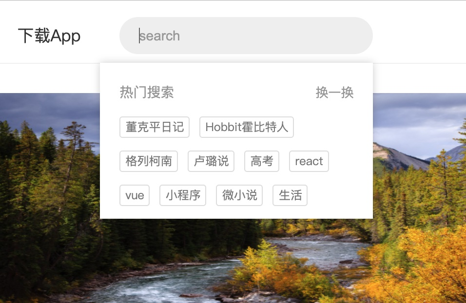

## Mock Jianshu

This is a simple fontend project, which simulate https://www.jianshu.com/.
(code do not include node packages)

Remove from other repo. See https://github.com/Icy-cui/Study-With-Linmi/tree/main/react_cc/jianshu

Using: React + Redux + styled components

--
#### Homepage

More posts can be loaded in homepage.

--
#### Recommendation

When you click search bar, the recommendation list will show.

--
#### Login
If you want to post, you must login first.

